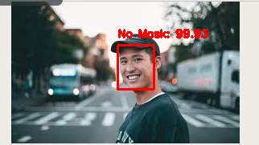

# Mask-detector
This repository contains the code to train on the artificial face mask dataset, to make inference on a single image and to make inference on a video stream.

## To make predictions on an image
``` python3 detect_mask_image.py -i image_path```




## To make predictions on video stream
``` pyhton3 detect_mask_video.py ```
